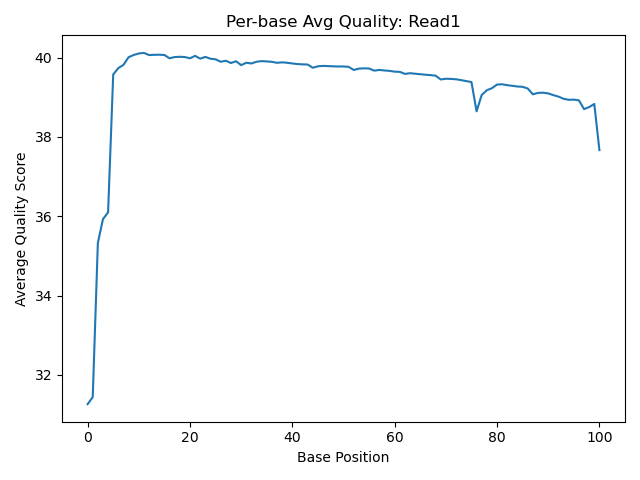
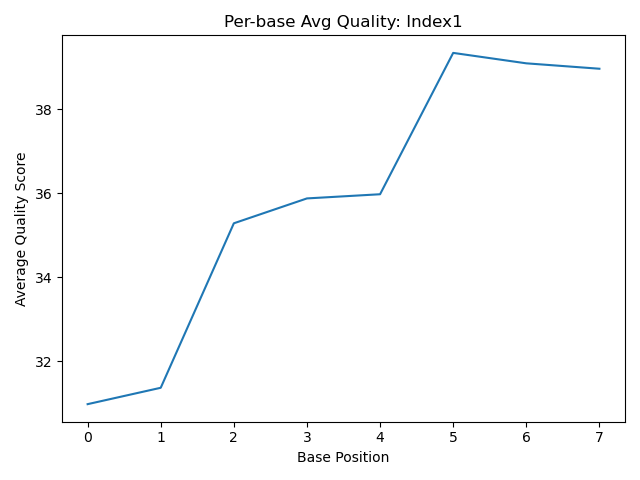
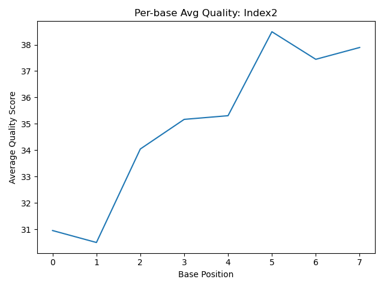
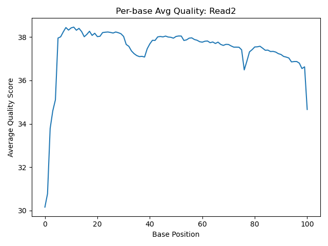

# Assignment the First

## Part 1
1. Be sure to upload your Python script. Provide a link to it here:

[Python Script](../part1.2.py),
[Script for Part 1](../part1.2.sh)

Lab notebook: 

[labnotebook](../LabNotebook.md)

| File name | label | Read length | Phred encoding |
|---|---|---|---|
| 1294_S1_L008_R1_001.fastq.gz | biological data | 101 | +33 |
| 1294_S1_L008_R2_001.fastq.gz | index 1 | 8 | +33 |
| 1294_S1_L008_R3_001.fastq.gz | index 2 | 8 | +33 |
| 1294_S1_L008_R4_001.fastq.gz | biological data | 101 | +33 |

    example code for phred encoding: 

    ```zcat 1294_S1_L008_R1_001.fastq.gz | awk 'NR%4==0 && NR%10000==0' | grep '[a-z]' -m 1 && echo "Phred+64 likely" || echo "Phred+33 likely"```

            Phred+33 likely


2. Per-base NT distribution
    1. 
            
            
            
    2.	What is a good quality score cutoff for index reads and biological read pairs to utilize for sample identification and downstream analysis, respectively? Justify your answer.

        I would suggest a qs cutoff of 30. This is based on the consistently higher mid-read scores for both Read 1 & 2, and poorer quality at the ends. Similarly for the indexes, there was variable quality, where scores dipped at the early positions due to presence of Ns (most likely), and then improves with later positions. A cutoff of 30 would avoid hopping or miscalls because of those lower quality bases or presence of Ns. 

        There were mentions of hamming distances across indexes in conversations with other students, but I do not understand this concept at all and won't even pretend to in this answer. So, quality filtering it is!


    3.	How many indexes have undetermined (N) base calls? (Utilize your command line tool knowledge. Submit the command(s) you used. CHALLENGE: use a one-line command)

            ```zcat /projects/bgmp/shared/2017_sequencing/1294_S1_L008_R2_001.fastq.gz | awk 'NR%4==2' | grep -c "N" ```

                3976613

            ```zcat /projects/bgmp/shared/2017_sequencing/1294_S1_L008_R3_001.fastq.gz | awk 'NR%4==2' | grep -c "N" ```

                3328051

## Part 2
1. Define the problem

 We have a large amount of prepped genomic library data from multiple different samples, and need to demultiplex the data in order to perform downstream analyses like quality filtering index reads and determining rates of index swapping or undetermined index pairs. We have 24 indexed (dual matched) libraries that were submitted for sequencing, and four large input files to parse through: 

    1294_S1_L008_R1_001.fastq.gz -- representing biological read 1
    1294_S1_L008_R2_001.fastq.gz -- representing index read 1
    1294_S1_L008_R3_001.fastq.gz -- representing index read 2 (reverse-complemented)
    1294_S1_L008_R4_001.fastq.gz -- representing biological read 2

To demultiplex, we need to parse through each file simultaneously and match each index1/index2 from each read pair (R1, R4) to the list of 24 indexes. They will fall in one of three categories:   
    * correctly matched pairs --> index 1 matches index 2 and they are one of the 24 known index libraries   
    * index hopped pairs --> both are valid indexes but they do not match (and where did they mismatch from?)   
    * unknown pairs --> one or both are not on the list, or fall below quality threshold, have Ns, etc. 

We also need to:   
    * append the sequence of the index-pair to the header of BOTH reads in all of the output FASTQ files for ALL categories    
    * report:  
            the number of read-pairs with properly matched indexes (per index-pair),  
            the number of read pairs with index-hopping observed. 
            the number of read-pairs with unknown index(es).


2. Describe output

We are expecting to output:  
        48 FASTQ files containing acceptable index pairs (ex: Index A: IA_Read 1 and IA_Read 2 → for all 24 indexes)  
        2 FASTQ files with index-hopped reads and their bio data pairs  
        2 FASTQ files with undetermined (non-matching or low quality) index-pairs  
        == 52 fq output files total


3. Upload your [4 input FASTQ files](../TEST-input_FASTQ) and your [>=6 expected output FASTQ files](../TEST-output_FASTQ).
[R1 test file](../TEST-input_FASTQ/R1_tinytest.fq)
[R2 test file](../TEST-input_FASTQ/R2_tinytest.fq)
[R3 test file](../TEST-input_FASTQ/R3_tinytest.fq)
[R4 test file](../TEST-input_FASTQ/R4_tinytest.fq)

[output text test files](../TEST-output_FASTQ)

Mock report: 

    2 matched index pairs   
    1 index hopped pair   
    1 unknown index pair   
    x2 per read --> 8 output files   


4. Pseudocode


        STORE indexes as a set of strings, maybe tuple 
        READ in and open all four .fastq files (R1, R2, R3, R4) in parallel using gzip  
        WHILE not EOF:
        OPEN files for writing: <indexes>_R1.fastq, <indexes>_R2.fastq, unknown_R1.fastq, unknown_R2.fastq, hopped_R1.fastq, hopped_R2.fastq

        read 4 lines from R1:   
            SET <R1>_ + header, seq, plus, quality
        read 4 lines from R2: 
            SET <index1>_ + header, seq, plus, quality
        read 4 lines from R3:   
            SET <index2>_ + header, seq, plus, quality
        read 4 lines from R4: 
            SET <R2>_ + header, seq, plus, quality
        
        SET count for unknown index pairs = 0
        SET dictionaries for matched, hopped pairs: 
            matched_indexes = dict{int}
            hopped_indexes = dict{int}
        
        LOOP through all four files per one record (four lines) at a time
            reverse_complement index2_seq --> index2_rc
            
            # screening for low quality / Ns

            IF "N" in one or both index1_seq or index2_rc or if quality filter fails:
                THEN append <index1>-<index2> to header of both R1 and R2 
                WRITE R1 to R1_unknown, R2 to R2_unknown
                INCREMENT unknown count
                continue

            # matches

            ELSE IF index1_seq == index2_rc and index1_seq is in known indexes:
                THEN append <index1>-<index2> to header of both R1 and R2
                WRITE R1 to <this_index>_R1.fq file, write R2 to <this_index>_R2.fq file
                IF <index1>-<index2> in matched_indexes:
                    matched_indexes{<index1>-<index2>} += 1
                ELSE:
                    matched_indexes{<index1>-<index2>} = 1 
                continue 

            # for index hoppers 

            ELSE IF index1_seq in known indexes, index2_rc in known indexes, and index1_seq != index2_rc:
                THEN append <index1>-<index2> to header of both R1 and R2
                THEN send R1 to hopped_R1.fq file, R4 to hopped_R2.fq file
                IF <index1>-<index2> in hopped_indexes:
                    hopped_indexes{<index1>-<index2>} += 1 
                ELSE:
                    hopped_indexes{<index1>-<index2>} = 1
                continue

            # for all other unknown scenarios

            ELSE:
                THEN append <index1>-<index2> to header of both R1 and R2 
                WRITE R1 to R1_unknown, R2 to R2_unknown
                INCREMENT unknown count
        
        WRITE matched, hopped dictionaries to .txt files
        RUTURN wc -l for matched, hopped dicts
        PRINT unknown counts
        


5. High level functions:


        def convert_phred(letter: str) -> int:
            '''Converts a single character into a phred score'''
            return ord(letter)-33 

        test example: 
            Input: I
            Expected output: 40
        assert convert_phred("I") == 40, "wrong phred score for 'I'"


        def reverse_complement(seq:str) -> str:
            '''Returns the reverse compliment of a DNA sequence'''
            SET dictionary to matched complement pairs: {A:T, G:C, C:G, T:A}
            return new_seq

        test example: 
            Input: "GTCA" 
            Output: "TGAC"
        assert reverse_complement("GTCA")=="TGAC", "Incorrect reverse complement"


        def quality_filter(index_seq:str,qual_str:str, threshold:int = 30)-> bool:
            '''Returns True if all bases exceed threshold value, no N present'''
            IF 'N' in index_seq:
                return False
            ELSE
                return all(convert_phred) >= threshold 
        
        test example:
            Input: "TATGCCC", "IIIIIII" 
            Ouput: True

        def qual_score(phred_score: str) -> float:
            '''Fuction that iterates through the phred_score string, calculates quality score using convert_phred function, and returns the calculated average quality score of the entire string'''
            average=0
            for i, letter in enumerate(phred_score):
                average += convert_phred(phred_score[i])
            average /= len(phred_score)
            return average
        Test example:
            Input: "EEE"
            Ouptut: 36

            assert qual_score("EEE") == 36
            assert qual_score("#I") == 21
            assert qual_score("EJ") == 38.5
            print("You calcluated the correct average phred score")

    
